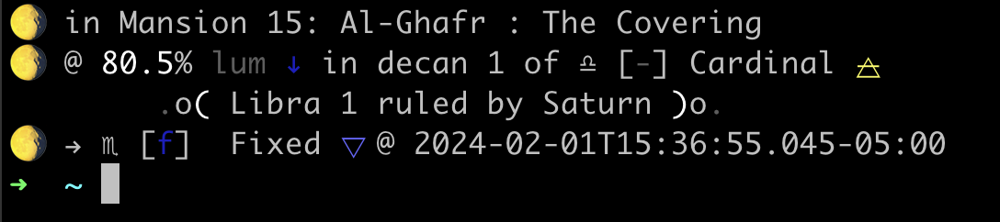

# fated-sky

An evolving side-project-level Astrology library and set of scripts that I find personally useful or interesting.

## Requirements

- You have the ephemeris files downloaded and stored somewhere accessible by this code.
  - [See this note at the sweph docs](https://github.com/timotejroiko/sweph?tab=readme-ov-file#ephemeris-files)
  - It points here: https://github.com/aloistr/swisseph/tree/master where you can grab what you need.
- See the provided [example-locations.json](./example-locations.json) and add whatever named locations you want
  - Most scripts can also directly take `geo` coordinates at the command line.

## Scripts

### moonprompt.ts



To your `~/.zshrc` add something along the lines of:

```sh
function precmd() {
    /path/to/moonprompt.js -l /path/to/locations.json -n newyork -e /path/to/ephe
}
```

Build the `JS` via `npm run build`. It also needs to be set executable via:

```sh
chmod +x dist/moonprompt.js
```

#### Running Examples

```
npm run start

# > start
# > ts-node src/moonprompt.ts --help
#
# Usage: moonprompt [options]
#
# Options:
#   -l, --locations <file>  A path to a locations JSON
#   -n, --name <name>       The location key name to use
#   -g, --geo <long,lat>    Geographic location: long,lat
#   -e, --ephe <filepath>   The path to the Swiss Ephemeris data files
#   -h, --help              display help for command
```