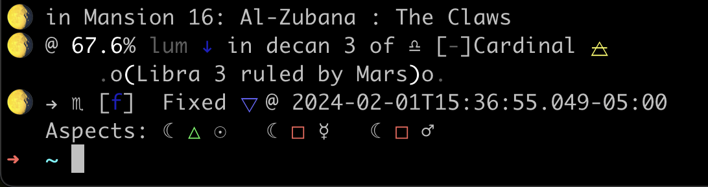

# fated-sky

An evolving side-project-level Astrology library and set of scripts that I find personally useful or interesting.

## Requirements

- You have the ephemeris files downloaded and stored somewhere accessible by this code.
  - [See this note at the sweph docs](https://github.com/timotejroiko/sweph?tab=readme-ov-file#ephemeris-files)
  - It points here: https://github.com/aloistr/swisseph/tree/master where you can grab what you need.
- See the provided [example-locations.json](./example-locations.json) and add whatever named locations you want
  - Most scripts can also directly take `geo` coordinates at the command line.

## Scripts

### moonprompt.ts



To your `~/.zshrc` add something along the lines of:

```sh
function precmd() {
    /path/to/moonprompt.js -l /path/to/locations.json -n newyork -e /path/to/ephe
}
```

Build the `JS` via `npm run build`. It also needs to be set executable via:

```sh
chmod +x dist/moonprompt.js
```

#### Running Examples

```
npm run moonprompt:start

# > start
# > ts-node src/moonprompt.ts --help
#
# Usage: moonprompt [options]
#
# Options:
#   -l, --locations <file>  A path to a locations JSON
#   -n, --name <name>       The location key name to use
#   -g, --geo <long,lat>    Geographic location: long,lat
#   -e, --ephe <filepath>   The path to the Swiss Ephemeris data files
#   -h, --help              display help for command
```

### phours.ts

Generate the planetary hours for `today` or a specified day.

Not specifying a date defaults to today. If you use `-d YYYY-MM-YY`, the hours will be generated for this day instead.

#### Running Examples

```
npm run phours:start -- --locations ./locations.json --name indianapolis -e ./ephe
``` 

```
> phours:start
> ts-node src/phours.ts --locations ./locations.json --name indianapolis -e ./ephe


The ruler of Tuesday is mars (Ares)

Day Hours
1 mars: 07:54:06 to 08:44:10
2 sun: 08:44:10 to 09:34:14
3 venus: 09:34:14 to 10:24:17
4 mercury: 10:24:17 to 11:14:21
5 moon: 11:14:21 to 12:04:25
6 saturn: 12:04:25 to 12:54:28
7 jupiter: 12:54:28 to 13:44:32
8 mars: 13:44:32 to 14:34:36
9 sun: 14:34:36 to 15:24:39
10 venus: 15:24:39 to 16:14:43
11 mercury: 16:14:43 to 17:04:47
12 moon: 17:04:47 to 17:54:50

Night Hours
13 saturn: 17:54:50 to 19:04:42
14 jupiter: 19:04:42 to 20:14:34
15 mars: 20:14:34 to 21:24:25
16 sun: 21:24:25 to 22:34:17
17 venus: 22:34:17 to 23:44:09
18 mercury: 23:44:09 to 00:54:00
19 moon: 00:54:00 to 02:03:52
20 saturn: 02:03:52 to 03:13:44
21 jupiter: 03:13:44 to 04:23:36
22 mars: 04:23:36 to 05:33:27
23 sun: 05:33:27 to 06:43:19
24 venus: 06:43:19 to 07:53:11
```